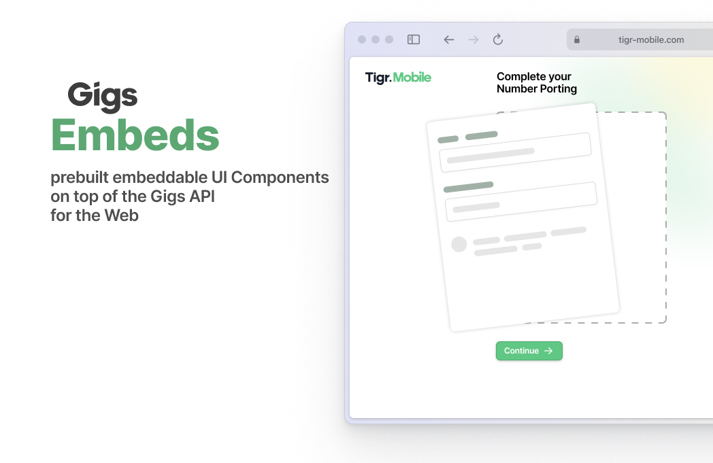

# Gigs Embeds for React Native



Embeddable prebuilt and customizable UI components to use in your own React Native app.

> [!NOTE]
> This library is currently under development.

## Installation

```sh
npm install @gigscom/embeds-react-native
```

## Getting started

To use Gigs Embeds, you need:

1. A Gigs project
2. A Gigs API Key
3. A server to create an [authenticated Connect Session](https://developers.gigs.com/docs/api/cdb1438ed4da9-creating-connect-sessions)

> [!TIP]
> You're not yet a Gigs customer? [Get in touch](https://gigs.com/contact) to discuss the next steps!

## How it works

When a user visits the screen in your app containing the Embed, request a Connect Session from your server endpoint. Afterward, you can render the Embed component. 

## Usage

- [Porting Embed](docs/porting-embed.md)

## Contributing

This project was bootstrapped with [create-react-native-library](https://callstack.github.io/react-native-builder-bob/create).

See the [contributing guide](CONTRIBUTING.md) to learn how to contribute to the repository and the development workflow.
