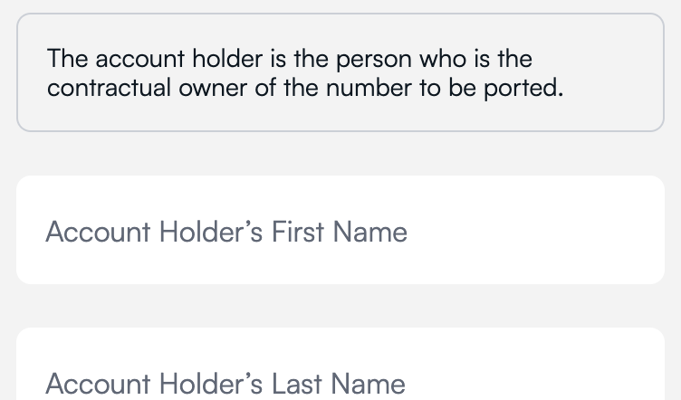
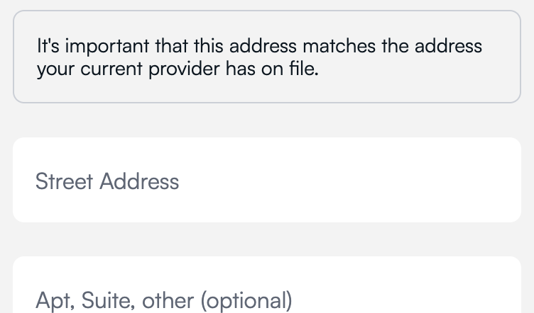

# Porting Embed

The Porting Embed allows a user to complete a number porting inside your app.

[Number Porting](https://developers.gigs.com/docs/api/29f8ee7096761-how-porting-works) is split up into multiple steps:

1. Carrier Details (Account Number & PIN)
2. Account Holder Details (First Name, Last Name & Birthday)
3. Account Holder Address
4. Donor Provider Approval

Each step is displayed only if the porting requires certain fields. If the user hasn't filled out these fields yet or if they have but some fields need updating, the step will be shown. When the user submits a step, the porting is updated, and they move on to the next step. This continues until all fields are filled out.

## Usage

1. Create a Gigs [Connect Session](https://developers.gigs.com/docs/api/cdb1438ed4da9-creating-connect-sessions) on your own server.
2. Pass the session object from your server to your app.
3. Initialize the embed using the session object with an intent of type `completePorting`, your project ID and an `onCompleted` callback function.
4. Navigate the user to the next screen once the number porting is completed.
5. (Optional) Handle the case where a component is loaded or has initialization errors.

## Example app

See [`example/porting/index.tsx`](/example/porting/index.tsx) for a full example implementation.

## Reference

### Initializing the Porting Embed

    ```jsx
    <PortingEmbed
     connectSession={session}
     project="yourProject"
     onCompleted={() => navigate('SuccessScreen')}
    />
    ```

### Required props

#### `connectSession`

The complete Connect Session object which you created on your server and passed to the browser. Do not store this.

#### `project`

The ID of your Gigs Project.

### `onCompleted`

`(porting:  Porting)  =>  unknown`
Callback triggered when the number porting is completed.
`porting` - The whole porting object.

#### `onError`

`(error?:  Error, porting?: Porting, errorCode?: PortingEmbedError)  =>  unknown`

Callback triggered when: 
* There is an error initializing the porting form. The error may stem from an invalid session, in which case recovery can be attempted by generating and passing a new Connect session to the embed. The `error` is passed as an argument to the callback.
* There is a failed attempt to retrieve a subscription. In this case it is advisable to inform the user to try again later or to contact customer support for assistance. The `error` is passed as an argument to the callback.
* The porting has been declined. The `porting` object and the error code `portingDeclined` are passed as arguments to the callback. 

### Optional props

#### `onInitialized`

`()  =>  unknown`
Callback triggered when the embed is initialized. Mostly useful for debugging purposes. In most cases you want to use `onLoaded` to know when the component is ready.

#### `onLoaded`

`()  =>  unknown`
Callback triggered when the embed form is loaded with a subscription and the related porting.

#### `onPortingStep`

`(step: PortingStep) => unknown`  
Callback that returns the current porting step. Useful to display custom headlines and information in your app depending on the step.

#### `renderTitle`

`(step: PortingStep) => unknown`  
Render prop function that can be used to customise the porting form headline depending on the step. No headline is displayed if there is no `renderTitle` prop passed to the embed.

`step` - The current porting step.
Returns a React node representing the customized title.

```jsx
const titles: Record<string, string> = {
  holderDetails: 'Account Holder Information',
  carrierDetails: 'Carrier Details Information',
  address: 'Address Information',
}

<PortingEmbed
//...
renderTitle={(step) =>
            step != null && (
              <Text style={[customStyles.title]}>{titles[step]}</Text>
            )
          }
/>
```

#### `renderInput`

`(name: string, onChange: (value: string) => void, inputMode?: InputModeOptions) => React.ReactNode`  
Render prop function that can be used to customise the porting form inputs.
If no `renderInput` prop is passed to the embed, a default input component is displayed instead.

`name` - The name of the input.
`onChange` - Function to handle input value changes.
`inputMode` - Optional input mode (`'text'`, `'numeric'`, etc).
Returns a React node representing the customized input component.

```jsx
const titles: Record<string, string> = {
  'holderDetails.firstName': 'First name',
  'holderDetails.lastName': 'Last name',
  'holderDetails.birthday': 'Birthday',
}

<PortingEmbed
//...
renderInput={(name, onChangeText, inputMode) => (
            <TextInput
              onChangeText={onChangeText}
              placeholder={titles[name]}
              style={[customStyles.input]}
              inputMode={inputMode}
            />
          )}
/>
```

#### `renderCheckbox`

`(onChecked: (checked: boolean) => void) => React.ReactNode`
Render prop function that can be used to customize the rendering of a checkbox.
If no `renderCheckbox` prop is passed to the component, a default checkbox component is displayed instead.

`onChecked` - Function to handle checkbox `checked` changes.
Returns a React node representing the customized checkbox component.

```jsx
const [isChecked, setChecked] = useState(false)

<PortingEmbed
//...
renderCheckbox={(onChecked) => (
            <View>
              <Checkbox
                onValueChange={(checked) => {
                  onChecked(checked)
                  setChecked(checked)
                }}
                value={isChecked}
                color={isChecked ? 'black' : undefined}
              />
              <Text>I confirm that I have requested my provider approval.</Text>
            </View>
          )}
/>
```

#### `renderPrimaryButton`

`(onPress: () => void, name?: string, isSubmitting?: boolean, disabled?: boolean) => React.ReactNode`
Render prop function that can be used to customize the rendering of a primary button (e.g. the form submit action).
If no `renderPrimaryButton` prop is passed to the component, a default primary button component is displayed instead.

`onPress` - Function to handle button press event.
`name` - Optional name for the button.
`isSubmitting` - Optional boolean indicating if the button is in a submitting state.
`disabled` - Optional boolean indicating if the button is disabled.
Returns a React node representing the customized primary button component.

```jsx
const titles: Record<string, string> = {
  'protectionDisabling.cancel': 'Cancel',
}

<PortingEmbed
//...
renderPrimaryButton={(onPress, name, isSubmitting, disabled) => {
            const title = name ? titles[name] : undefined
            return (
              <Button
                title={title ? title : isSubmitting ? 'Loading...' : 'Submit'}
                onPress={onPress}
                disabled={disabled}
                color={'blue'}
              />
            )
          }}
/>
```

#### `renderSecondaryButton`

`(name: string, onPress: () => void) => React.ReactNode`
Render prop function that can be used to customize the rendering of a secondary button (e.g. the form cancelation action).
If no `renderSecondaryButton` prop is passed to the component, a default secondary button component is displayed instead.

`onPress` - Function to handle button press event.
`name` - Optional name for the button.
Returns a React node representing the customized secondary button component.

```jsx
  const titles: Record<string, string> = {
    'protectionDisabling.button': 'Request Porting Again',
  }

<PortingEmbed
//...
renderSecondaryButton={(name, onPress) => (
            <Pressable onPress={onPress}>
              <Text
                style={[
                  {
                    color: 'orange',
                  },
                ]}
              >
                {titles[name]}
              </Text>
            </Pressable>
          )}
/>
```

#### `renderAlertBanner`

`(variant: 'error' | 'info', message: string) => React.ReactNode`
Render prop function that can be used to customize the rendering of alert banners in the embed.
Alert banners are used either to convey information or to display errors.
The `'info'` type appears in the `holderDetails` and `address` steps as follows:




The `'error'` type appears whenever there is an error after submitting a porting step, or if the porting has been declined (see all the declined messages [here](https://github.com/gigs/embeds-react-native/blob/main/src/PortingEmbed/util/portingUtils.tsx#L96)).

`variant` - The variant of the alert banner (either 'error' or 'info').
`message` - The message to be displayed in the alert banner.
Returns a React node representing the customized alert banner component.

```jsx
<PortingEmbed
  //...
  renderAlertBanner={(variant, message) => (
    <View
      style={[
        {
          backgroundColor: variant === 'error' ? '#FFE4E6' : 'white',
        },
      ]}
    >
      <Text
        style={{
          color: variant === 'error' ? '#BE123C' : 'black',
        }}
      >
        {message}
      </Text>
    </View>
  )}
/>
```

#### `renderDate`

`(name: string, onChange: (value: string) => void) => React.ReactNode`
Render prop function that can be used to customize the rendering of a date input.
If no `renderDate` prop is passed to the component, a default input component is displayed instead.

`name` - The name of the date input.
`onChange` - Function to handle date input value changes.

```jsx
const [date, setDate] = useState<Date | undefined>(new Date())

<PortingEmbed
//...
renderDate={(name, onChangeText) => (
            <DatePickerInput
              locale="en"
              label={titles[name]}
              value={date}
              placeholder="YYYY-MM-DD"
              onChange={(d) => {
                setDate(d)
                const year = d?.getFullYear()
                const month = `0${(d?.getMonth() ?? 0) + 1}`.slice(-2)
                const day = `0${d?.getDate()}`.slice(-2)

                const dateString = `${year}-${month}-${day}` // needs to be an RFC3339 date string
                onChangeText(dateString)
              }}
            />
          )}
/>
```

#### `renderPortingProtectionDisabledConfirmation`

`(onConfirm: () => void) => React.ReactNode`
Render prop function that can be used to customize the rendering of a component to confirm that porting protection has been disabled by the donor carrier.
If no `renderPortingProtectionDisabledConfirmation` prop is passed to the component, a default confirmation component is displayed instead.

`onConfirm` - Function to handle the confirmation action.

```jsx
<PortingEmbed
  //...
  renderPortingProtectionDisabledConfirmation={(onConfirm) => (
    <View>
      <Text>
        After you have received confirmation that port protection has been
        deactivated and your number is prepared for porting, kindly inform us by
        clicking the button below to confirm.
      </Text>
      <Button title={'Confirm'} onPress={onConfirm} color={'blue'} />
    </View>
  )}
/>
```

#### `defaultTextFont`

The default font that the embed uses for all default components, i.e. all components that are not replaced by a corresponding render prop (for example all inputs will use the `defaultTextFont` if no `renderInput` component was passed to the embed).

```jsx
<PortingEmbed
  //...
  defaultTextFont="Custom-font"
/>
```

#### `renderProvidersDropdown`

Render prop function that can be used to customize the rendering of a component to select the current carrier.
If no `renderProvidersDropdown` prop is passed to the component, a default component is displayed instead.

`name` - The name of the dropdown.
`providers` - List of IDs and names of providers.
`onChange` - Function to handle carrier ID value changes.

```jsx
  const titles: Record<string, string> = {
    'donorProvider.dropdown': 'Select your current carrier',
  }

<PortingEmbed
//...
renderProvidersDropdown={(name, providers, onChange) => (
            <Picker
              selectedValue={currentProvider}
              onValueChange={(itemValue, _itemIndex) => {
                onChange(itemValue as string)
                setCurrentProvider(itemValue)
              }}
              placeholder={titles[name]}
            >
              {providers.map((p) => {
                return <Picker.Item key={p.id} label={p.name} value={p.id} />
              })}
            </Picker>
          )}
/>
```

#### Porting Embed props

| Prop                                          | Type                   | Required | Description/Signature                                                                                            |
| --------------------------------------------- | ---------------------- | -------- | ---------------------------------------------------------------------------------------------------------------- | -------------------------------------------- |
| `connectSession`                              | Connect Session object | ✅       | A Connect Session object with an intent of type `completePorting`.                                               |
| `project`                                     | string                 | ✅       | Your project ID.                                                                                                 |
| `onCompleted`                                 | function               | ✅       | `(porting:  Porting)  =>  unknown`                                                                               |
| `onError`                                     | function               | ✅       | `(error?:  Error, porting?: Porting, errorCode?: PortingEmbedError)  =>  unknown`                                                                                   |
| `onInitialized`                               | function               | ❌       | `()  =>  unknown`                                                                                                |
| `onLoaded`                                    | function               | ❌       | `()  =>  unknown`                                                                                                |
| `onPortingStep`                               | function               | ❌       | `(step: PortingStep) => unknown`                                                                                 |
| `renderTitle`                                 | function               | ❌       | `(step: PortingStep) => unknown`                                                                                 |
| `renderCheckbox`                              | function               | ❌       | `(name: string, onChange: (value: string) => void, inputMode?: InputModeOptions) => unknown`                     |
| `renderPrimaryButton`                         | function               | ❌       | `(onPress: () => void, name?: string, isSubmitting?: boolean, disabled?: boolean) => React.ReactNode`            |
| `renderSecondaryButton`                       | function               | ❌       | `(name: string, onPress: () => void) => React.ReactNode`                                                         |
| `renderAlertBanner`                           | function               | ❌       | `(variant: 'error'                                                                                               | 'info', message: string) => React.ReactNode` |
| `renderDate`                                  | function               | ❌       | `(name: string, onChange: (value: string) => void) => React.ReactNode`                                           |
| `renderPortingProtectionDisabledConfirmation` | function               | ❌       | `(onConfirm: () => void) => React.ReactNode`                                                                     |
| `renderProvidersDropdown`                     | function               | ❌       | `(name: string, providers: {id: string; name: string;}[], onChange: (value: string) => void) => React.ReactNode` |
| `defaultTextFont`                             | string                 | ❌       | Custom font used in all default components.                                                                      |

#### Text

| Key                           | Default                     |
| ----------------------------- | --------------------------- |
| `carrierDetails`              | N/A                         |
| `carrierDetails.number`       | Account Number              |
| `carrierDetails.pin`          | Account PIN                 |
| `holderDetails`               | N/A                         |
| `holderDetails.firstName`     | Account Holder’s First Name |
| `holderDetails.lastName`      | Account Holder’s Last Name  |
| `holderDetails.birthday`      | Account Holder’s Birthday   |
| `holderDetails.cancel`        | Cancel                      |
| `address`                     | N/A                         |
| `address.line1`               | Street Address              |
| `address.line2`               | Apt, Suite, other           |
| `address.city`                | City                        |
| `address.postalCode`          | Postal Code                 |
| `address.state`               | State                       |
| `address.country`             | Country                     |
| `protectionDisabling.confirm` | Confirm                     |
| `protectionDisabling.cancel`  | Cancel                      |
| `portingInfoLink`             | See Porting instructions    |
| `protectionDisabling.button`  | Request Porting Again       |
| `donorProvider`               | N/A                         |
| `donorProvider.dropdown`      | Donor providers dropdown    |
